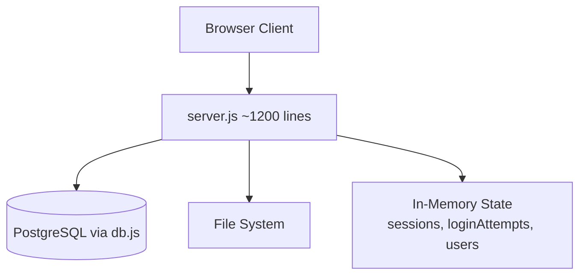
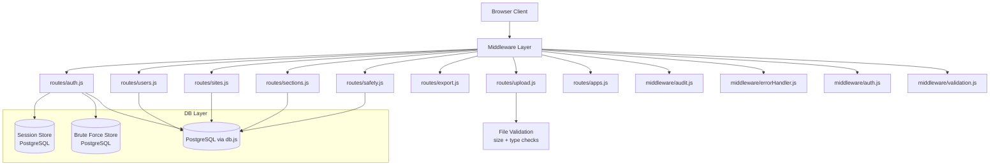
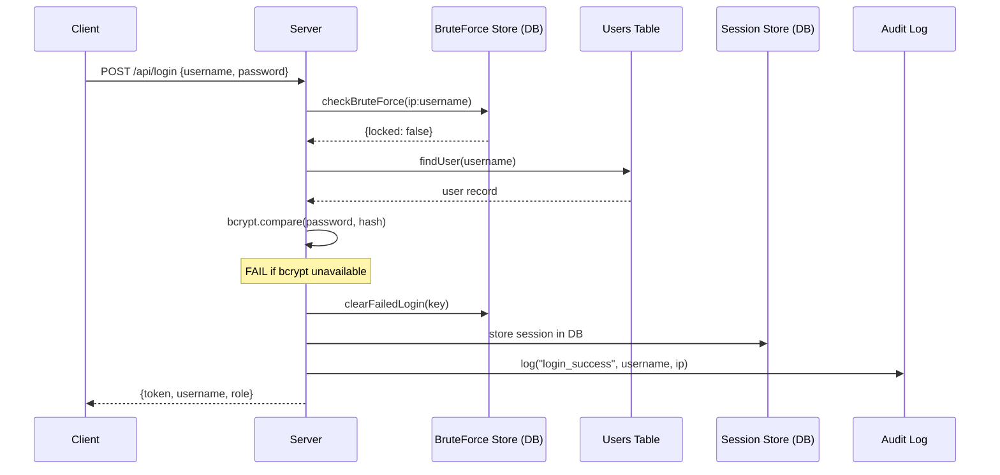
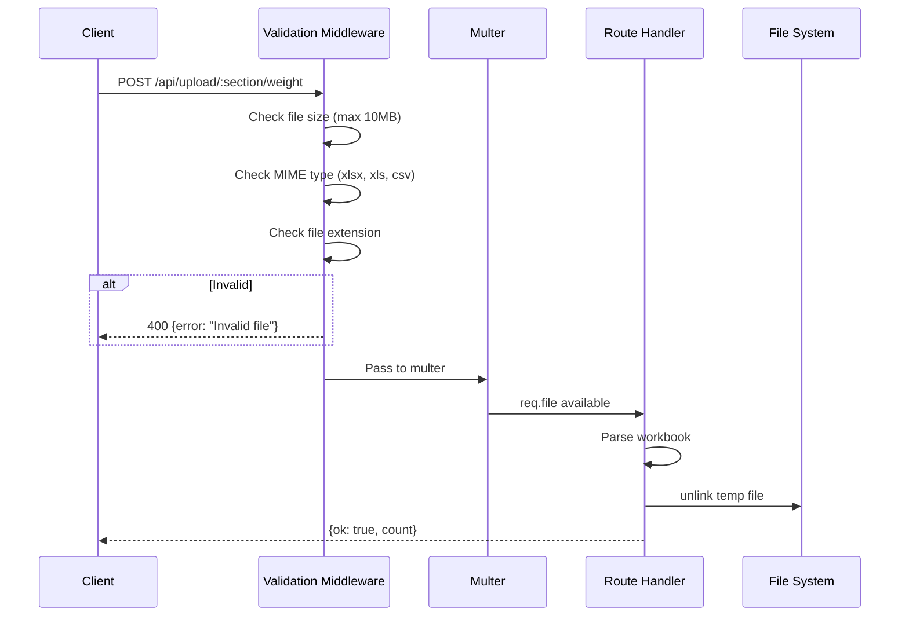

# Design Document: System QA Hardening

## Overview

The Task Tracker application has accumulated significant technical debt and security gaps identified during a QA review. This design addresses 16 issues spanning critical security vulnerabilities (hardcoded paths, in-memory session loss, weak password fallback), security hardening (file upload validation, CSP/CORS/CSRF, persistent brute-force tracking), code quality improvements (route modularization, async error handling, audit logging, server-side pagination), frontend accessibility (ARIA labels, keyboard navigation, storage quota management), and operational gaps (test suite, API documentation, migration rollback, naming conventions).

The approach prioritizes critical and security fixes first, then code quality refactoring, followed by frontend and operational improvements. The monolithic `server.js` (~1200 lines) will be decomposed into route modules, enabling cleaner separation of concerns and easier testing.

## Architecture

### Current Architecture (Monolithic)



### Target Architecture (Modularized)



## Sequence Diagrams

### Login Flow (Hardened)



### File Upload Flow (Hardened)



## Components and Interfaces

### Component 1: Route Modules

**Purpose**: Decompose the monolithic server.js into focused route files.

```javascript
// routes/auth.js
const router = require('express').Router();

router.post('/login', loginLimiter, async (req, res, next) => { /* ... */ });
router.post('/logout', (req, res) => { /* ... */ });
router.get('/me', authRequired, (req, res) => { /* ... */ });

module.exports = router;
```

**Route Module Breakdown**:
- `routes/auth.js` — login, logout, session management
- `routes/users.js` — CRUD, password changes, role/access management, import/export
- `routes/sites.js` — site CRUD, switching
- `routes/sections.js` — section CRUD, duplication
- `routes/apps.js` — app module CRUD, switching
- `routes/upload.js` — file uploads (weight, initials, tracker)
- `routes/export.js` — Excel/CSV/JSON exports
- `routes/safety.js` — JSA form routes
- `routes/state.js` — state get/set, billing

### Component 2: Persistent Session Store

**Purpose**: Replace in-memory `sessions` object with PostgreSQL-backed storage.

```javascript
// middleware/sessionStore.js
class PgSessionStore {
  async create(token, sessionData) { /* INSERT INTO sessions ... */ }
  async get(token) { /* SELECT ... WHERE token = $1 AND expires_at > NOW() */ }
  async touch(token) { /* UPDATE sessions SET last_activity = NOW() ... */ }
  async destroy(token) { /* DELETE FROM sessions WHERE token = $1 */ }
  async destroyByUsername(username) { /* DELETE ... WHERE username = $1 */ }
  async cleanup() { /* DELETE ... WHERE expires_at < NOW() */ }
}
```

**DB Schema Addition**:
```sql
CREATE TABLE IF NOT EXISTS sessions (
  token VARCHAR(64) PRIMARY KEY,
  username VARCHAR(100) NOT NULL,
  role VARCHAR(20) NOT NULL,
  created_at TIMESTAMP DEFAULT NOW(),
  last_activity TIMESTAMP DEFAULT NOW(),
  expires_at TIMESTAMP NOT NULL
);
CREATE INDEX idx_sessions_expires ON sessions(expires_at);
CREATE INDEX idx_sessions_username ON sessions(username);
```

### Component 3: Persistent Brute Force Store

**Purpose**: Replace in-memory `loginAttempts` with PostgreSQL-backed tracking.

```javascript
// middleware/bruteForceStore.js
class PgBruteForceStore {
  async check(key) { /* SELECT ... WHERE key = $1 */ }
  async recordFailure(key) { /* UPSERT attempt count, set lockout if >= MAX */ }
  async clear(key) { /* DELETE FROM login_attempts WHERE key = $1 */ }
  async cleanup() { /* DELETE ... WHERE locked_until < NOW() */ }
}
```

**DB Schema Addition**:
```sql
CREATE TABLE IF NOT EXISTS login_attempts (
  key VARCHAR(255) PRIMARY KEY,
  attempt_count INTEGER DEFAULT 0,
  locked_until TIMESTAMP,
  last_attempt TIMESTAMP DEFAULT NOW()
);
```

### Component 4: File Upload Validation

**Purpose**: Validate file uploads before processing.

```javascript
// middleware/uploadValidation.js
const ALLOWED_MIMES = [
  'application/vnd.openxmlformats-officedocument.spreadsheetml.sheet',
  'application/vnd.ms-excel',
  'text/csv'
];
const MAX_FILE_SIZE = 10 * 1024 * 1024; // 10MB

const uploadConfig = multer({
  dest: UPLOAD_DIR,
  limits: { fileSize: MAX_FILE_SIZE },
  fileFilter: (req, file, cb) => {
    const extOk = /\.(xlsx|xls|csv)$/i.test(file.originalname);
    const mimeOk = ALLOWED_MIMES.includes(file.mimetype);
    if (extOk && mimeOk) return cb(null, true);
    cb(new Error('Only .xlsx, .xls, and .csv files are allowed'));
  }
});
```

### Component 5: Security Middleware (CSP, CORS, CSRF)

**Purpose**: Enable proper Content Security Policy, CORS headers, and CSRF protection.

```javascript
// middleware/security.js
const helmet = require('helmet');
const cors = require('cors');

function setupSecurity(app) {
  app.use(helmet({
    contentSecurityPolicy: {
      directives: {
        defaultSrc: ["'self'"],
        scriptSrc: ["'self'", "https://cdn.jsdelivr.net"],
        styleSrc: ["'self'", "'unsafe-inline'"],
        imgSrc: ["'self'", "data:"],
        connectSrc: ["'self'"],
        fontSrc: ["'self'"],
        objectSrc: ["'none'"],
        frameAncestors: ["'self'"]
      }
    },
    hsts: { maxAge: 31536000, includeSubDomains: true }
  }));

  app.use(cors({
    origin: process.env.CORS_ORIGIN || false,
    credentials: true
  }));
}
```

### Component 6: Async Error Handler

**Purpose**: Wrap async route handlers to catch unhandled rejections.

```javascript
// middleware/errorHandler.js
function asyncHandler(fn) {
  return (req, res, next) => {
    Promise.resolve(fn(req, res, next)).catch(next);
  };
}

function globalErrorHandler(err, req, res, next) {
  console.error(`[${new Date().toISOString()}] Error:`, err.message);
  if (err.code === 'LIMIT_FILE_SIZE') {
    return res.status(413).json({ error: 'File too large. Maximum size is 10MB.' });
  }
  if (err.message && err.message.includes('Only .xlsx')) {
    return res.status(400).json({ error: err.message });
  }
  res.status(500).json({ error: 'Internal server error' });
}
```

### Component 7: Audit Logger

**Purpose**: Log security-relevant user actions to the database.

```javascript
// middleware/audit.js
async function auditLog(action, username, details = {}, req = null) {
  const ip = req ? (req.ip || req.connection.remoteAddress) : null;
  await db.pool.query(
    `INSERT INTO audit_log (action, username, ip_address, details, created_at)
     VALUES ($1, $2, $3, $4, NOW())`,
    [action, username, ip, JSON.stringify(details)]
  );
}
```

**DB Schema Addition**:
```sql
CREATE TABLE IF NOT EXISTS audit_log (
  id SERIAL PRIMARY KEY,
  action VARCHAR(100) NOT NULL,
  username VARCHAR(100),
  ip_address VARCHAR(45),
  details JSONB DEFAULT '{}',
  created_at TIMESTAMP DEFAULT NOW()
);
CREATE INDEX idx_audit_log_action ON audit_log(action);
CREATE INDEX idx_audit_log_created ON audit_log(created_at DESC);
CREATE INDEX idx_audit_log_username ON audit_log(username);
```

**Audited Actions**: `login_success`, `login_failed`, `logout`, `user_created`, `user_deleted`, `password_changed`, `role_changed`, `site_created`, `site_deleted`, `data_imported`, `data_exported`, `section_created`, `section_deleted`.

### Component 8: Server-Side Pagination

**Purpose**: Add proper pagination to API endpoints returning lists.

```javascript
// Pagination helper
function parsePagination(req, defaultLimit = 50, maxLimit = 500) {
  const page = Math.max(0, parseInt(req.query.page) || 0);
  const limit = Math.min(maxLimit, Math.max(1, parseInt(req.query.limit) || defaultLimit));
  const offset = page * limit;
  return { page, limit, offset };
}

// Usage in route
router.get('/api/tracker-rows', authRequired, async (req, res) => {
  const { page, limit, offset } = parsePagination(req);
  const { rows, total } = await db.getTrackerRowsPaginated(sectionId, offset, limit);
  res.json({ rows, total, page, limit, totalPages: Math.ceil(total / limit) });
});
```

## Data Models

### Session Model

```javascript
/**
 * @typedef {Object} Session
 * @property {string} token - 64-char hex token
 * @property {string} username
 * @property {string} role - 'superadmin' | 'admin' | 'user'
 * @property {Date} created_at
 * @property {Date} last_activity
 * @property {Date} expires_at
 */
```

### Audit Log Entry

```javascript
/**
 * @typedef {Object} AuditEntry
 * @property {number} id
 * @property {string} action - e.g. 'login_success', 'user_created'
 * @property {string} username
 * @property {string} ip_address
 * @property {Object} details - JSON payload with action-specific data
 * @property {Date} created_at
 */
```

### Login Attempt Record

```javascript
/**
 * @typedef {Object} LoginAttempt
 * @property {string} key - 'ip:username' composite key
 * @property {number} attempt_count
 * @property {Date|null} locked_until
 * @property {Date} last_attempt
 */
```

## Key Functions with Formal Specifications

### Function 1: hashPasswordSecure(password)

```javascript
async function hashPasswordSecure(password) {
  const bcrypt = require('bcrypt');
  return { hash: await bcrypt.hash(password, 12), salt: 'bcrypt' };
}
```

**Preconditions:**
- `password` is a non-empty string
- `bcrypt` package is installed and importable

**Postconditions:**
- Returns `{ hash, salt: 'bcrypt' }` with a valid bcrypt hash
- Throws if bcrypt is unavailable (no SHA256 fallback)

### Function 2: authRequired(req, res, next)

```javascript
async function authRequired(req, res, next) {
  const token = extractBearerToken(req);
  if (!token) return res.status(401).json({ error: 'Authentication required' });
  const session = await sessionStore.get(token);
  if (!session) return res.status(401).json({ error: 'Invalid or expired session' });
  await sessionStore.touch(token);
  req.user = session;
  next();
}
```

**Preconditions:**
- `req.headers.authorization` exists and starts with 'Bearer '
- Session store is connected and available

**Postconditions:**
- If valid token: `req.user` is populated, `next()` called, session `last_activity` updated
- If invalid/expired: 401 response, `next()` not called

### Function 3: validateUpload(file)

```javascript
function validateUpload(file) {
  const extOk = /\.(xlsx|xls|csv)$/i.test(file.originalname);
  const mimeOk = ALLOWED_MIMES.includes(file.mimetype);
  const sizeOk = file.size <= MAX_FILE_SIZE;
  return extOk && mimeOk && sizeOk;
}
```

**Preconditions:**
- `file` is a multer file object with `originalname`, `mimetype`, `size`

**Postconditions:**
- Returns `true` iff extension is xlsx/xls/csv AND MIME type matches AND size ≤ 10MB
- No side effects

**Loop Invariants:** N/A


## Algorithmic Pseudocode

### Migration Rollback Algorithm

```javascript
// migrate-to-db.js — enhanced with rollback
async function migrateWithRollback(dataDir) {
  const client = await pool.connect();
  const backupFile = path.join(dataDir, `backup-pre-migration-${Date.now()}.json`);
  
  try {
    // Step 1: Snapshot current DB state
    const snapshot = await captureDBSnapshot(client);
    fs.writeFileSync(backupFile, JSON.stringify(snapshot, null, 2));
    console.log(`Backup saved to ${backupFile}`);
    
    // Step 2: Begin transaction
    await client.query('BEGIN');
    
    // Step 3: Run migration steps
    await migrateUsers(client, dataDir);
    await migrateSites(client, dataDir);
    await migrateSiteStates(client, dataDir);
    
    // Step 4: Validate migration
    const valid = await validateMigration(client, dataDir);
    if (!valid) throw new Error('Migration validation failed');
    
    // Step 5: Commit
    await client.query('COMMIT');
    console.log('Migration committed successfully');
    
  } catch (err) {
    // Rollback transaction
    await client.query('ROLLBACK');
    console.error('Migration failed, rolled back:', err.message);
    
    // Restore from snapshot if needed
    if (fs.existsSync(backupFile)) {
      console.log(`Backup available at: ${backupFile}`);
      console.log('Run: node migrate-to-db.js --restore <backup-file>');
    }
    throw err;
  } finally {
    client.release();
  }
}
```

**Preconditions:**
- Database is accessible and schema is initialized
- `dataDir` contains valid JSON migration source files

**Postconditions:**
- On success: all data migrated, transaction committed, backup file exists
- On failure: transaction rolled back, no partial data, backup file available for manual restore

### Environment Configuration Algorithm

```javascript
// config.js — centralized configuration
function loadConfig() {
  const required = ['DB_HOST', 'DB_NAME', 'DB_USER', 'DB_PASS'];
  const missing = required.filter(k => !process.env[k]);
  if (missing.length > 0 && process.env.NODE_ENV === 'production') {
    throw new Error(`Missing required env vars: ${missing.join(', ')}`);
  }
  
  return {
    port: parseInt(process.env.PORT) || 3002,
    db: {
      host: process.env.DB_HOST || 'localhost',
      port: parseInt(process.env.DB_PORT) || 5432,
      database: process.env.DB_NAME || 'task_tracker',
      user: process.env.DB_USER || 'postgres',
      password: process.env.DB_PASS || 'postgres',
    },
    trackerDir: process.env.TRACKER_DIR || null, // No hardcoded path
    sessionTimeout: parseInt(process.env.SESSION_TIMEOUT) || 30 * 60 * 1000,
    maxLoginAttempts: parseInt(process.env.MAX_LOGIN_ATTEMPTS) || 5,
    lockoutDuration: parseInt(process.env.LOCKOUT_DURATION) || 15 * 60 * 1000,
    corsOrigin: process.env.CORS_ORIGIN || false,
    maxFileSize: parseInt(process.env.MAX_FILE_SIZE) || 10 * 1024 * 1024,
  };
}
```

**Preconditions:**
- `.env` file exists or environment variables are set
- `dotenv` package loaded before this function is called

**Postconditions:**
- Returns a complete config object with all values resolved
- Throws in production if required DB vars are missing
- `trackerDir` is `null` if not set (no hardcoded Windows path)

## Example Usage

### Modularized Server Setup

```javascript
// server.js (refactored — ~50 lines)
require('dotenv').config();
const express = require('express');
const path = require('path');
const config = require('./config');
const db = require('./db');
const { setupSecurity } = require('./middleware/security');
const { globalErrorHandler } = require('./middleware/errorHandler');
const { auditLog } = require('./middleware/audit');

const app = express();

// Security middleware
setupSecurity(app);
app.use(express.json({ limit: '10mb' }));
app.use(express.static(path.join(__dirname, 'public')));

// Route modules
app.use('/api', require('./routes/auth'));
app.use('/api', require('./routes/users'));
app.use('/api', require('./routes/sites'));
app.use('/api', require('./routes/sections'));
app.use('/api', require('./routes/apps'));
app.use('/api', require('./routes/upload'));
app.use('/api', require('./routes/export'));
app.use('/api', require('./routes/state'));
app.use('/safety', require('./routes/safety'));
app.use('/users', require('./routes/usersApp'));

// Global error handler (must be last)
app.use(globalErrorHandler);

async function startServer() {
  await db.initDB();
  app.listen(config.port, () => {
    console.log(`Task Tracker running on port ${config.port}`);
  });
}

startServer();
```

### Async Route with Error Handling

```javascript
// routes/sites.js
const { asyncHandler } = require('../middleware/errorHandler');
const { auditLog } = require('../middleware/audit');

router.post('/', authRequired, adminRequired, asyncHandler(async (req, res) => {
  const { name } = req.body;
  if (!name || !name.trim()) {
    return res.status(400).json({ error: 'Site name required' });
  }
  const site = await db.createSite(generateId(name), name.trim(), activeAppId);
  await auditLog('site_created', req.user.username, { siteName: name }, req);
  res.json({ ok: true, site });
}));
```

### Frontend Accessibility Enhancement

```html
<!-- Before -->
<button class="btn btn-primary" onclick="doLogin()">Sign In</button>

<!-- After -->
<button class="btn btn-primary" onclick="doLogin()" 
        aria-label="Sign in to Task Tracker"
        role="button">Sign In</button>

<!-- Keyboard navigation for tab buttons -->
<div class="tabs" role="tablist" aria-label="Main navigation">
  <button class="tab-btn active" role="tab" aria-selected="true" 
          tabindex="0" aria-controls="tab-setup"
          onclick="switchTab('setup')">Setup</button>
  <button class="tab-btn" role="tab" aria-selected="false" 
          tabindex="-1" aria-controls="tab-tracker"
          onclick="switchTab('tracker')">Tracker</button>
</div>

<!-- Tab panel -->
<div id="tab-setup" class="tab-content active" role="tabpanel" 
     aria-labelledby="setup-tab">
```

## Correctness Properties

*A property is a characteristic or behavior that should hold true across all valid executions of a system-essentially, a formal statement about what the system should do. Properties serve as the bridge between human-readable specifications and machine-verifiable correctness guarantees.*

### Property 1: Password hashing round-trip

*For any* valid password string, hashing it with `hashPasswordSecure` and then verifying the original password against the resulting hash using `bcrypt.compare` shall return true, and verifying any different password shall return false.

**Validates: Requirements 3.1, 3.4**

### Property 2: Session store round-trip

*For any* session data (token, username, role, expiration), creating a session via `Session_Store.create` and then retrieving it via `Session_Store.get` shall return equivalent session data. Destroying the session and then retrieving it shall return null.

**Validates: Requirements 2.1, 2.2, 2.6**

### Property 3: Session activity tracking

*For any* active session, calling `Session_Store.touch(token)` shall update the `last_activity` timestamp to a value greater than or equal to the previous `last_activity`.

**Validates: Requirement 2.3**

### Property 4: Session expiry enforcement

*For any* session whose `last_activity` is older than the configured timeout, the Auth_Middleware shall reject the token with a 401 status and the Session_Store cleanup shall remove it from the database.

**Validates: Requirements 2.4, 2.5**

### Property 5: File upload validation determinism

*For any* file object with properties (originalname, mimetype, size), the Upload_Validator accepts the file if and only if the extension matches `.xlsx`, `.xls`, or `.csv` AND the MIME type is in the allowed list AND the size is ≤ 10MB. The validation result is deterministic and consistent across repeated calls.

**Validates: Requirements 4.1, 4.2, 4.3, 4.4**

### Property 6: Security headers presence

*For any* HTTP response from the Server, the response shall include a Content-Security-Policy header with `default-src 'self'`, `script-src 'self' https://cdn.jsdelivr.net`, `object-src 'none'`, and `frame-ancestors 'self'`, and shall not include an `X-Powered-By` header.

**Validates: Requirements 5.1, 5.2, 5.3, 5.4**

### Property 7: Brute force lockout cycle

*For any* IP:username key, recording N consecutive failed logins (where N equals the configured maximum) shall result in a lockout. While locked out, login attempts for that key shall be rejected with 429. After a successful login clears the record, subsequent checks shall report no lockout.

**Validates: Requirements 6.1, 6.2, 6.3, 6.4**

### Property 8: Brute force cleanup

*For any* set of lockout records in the `login_attempts` table, after the cleanup job runs, no records with `locked_until` in the past shall remain.

**Validates: Requirement 6.5**

### Property 9: Async error handler forwarding

*For any* async function that throws an error, wrapping it with `asyncHandler` shall catch the rejection and call `next(err)`. For any unrecognized error, the global error handler shall return a 500 status with a generic message.

**Validates: Requirements 8.1, 8.2, 8.4**

### Property 10: Audit log completeness

*For any* state-mutating API call (login, logout, user CRUD, password change, role change, site/section CRUD, data import/export), the Audit_Logger shall create an entry in the `audit_log` table containing the action name, acting username, and client IP address.

**Validates: Requirements 9.1, 9.2, 9.3, 9.4, 9.5, 9.6**

### Property 11: Pagination parameter bounds

*For any* combination of `page` and `limit` query parameters, the Pagination_Helper shall return `page >= 0`, `1 <= limit <= 500`, and `offset = page * limit`. Negative page values shall be treated as 0, missing values shall default to page=0 and limit=50, and limit values exceeding 500 shall be capped at 500.

**Validates: Requirements 10.1, 10.2, 10.3**

### Property 12: Pagination response invariants

*For any* paginated API response, the response shall contain fields `rows`, `total`, `page`, `limit`, and `totalPages`, where `rows.length <= limit` and `totalPages = ceil(total / limit)`.

**Validates: Requirements 10.4, 10.5**

### Property 13: Configuration environment variable resolution

*For any* value of the `TRACKER_DIR` environment variable, the Config_Loader shall return that exact value as the tracker directory. When `TRACKER_DIR` is unset, the Config_Loader shall return null.

**Validates: Requirement 1.1**

### Property 14: Migration atomicity

*For any* migration execution, if any step fails, the database state shall be identical to the pre-migration state (transaction rolled back) and a backup file shall exist. If all steps succeed, all data shall be committed.

**Validates: Requirements 13.2, 13.3, 13.4**

### Property 15: Data mapping round-trip

*For any* valid JavaScript object written to the database, reading it back and mapping snake_case columns to camelCase properties shall produce an equivalent object.

**Validates: Requirement 14.4**

## Error Handling

### Error Scenario 1: bcrypt Unavailable

**Condition**: `require('bcrypt')` throws (native module not compiled)
**Response**: Server refuses to start. Logs clear error: "bcrypt is required. Run: npm rebuild bcrypt"
**Recovery**: User must install/rebuild bcrypt before server can start

### Error Scenario 2: File Upload Too Large

**Condition**: Uploaded file exceeds 10MB limit
**Response**: Multer rejects with `LIMIT_FILE_SIZE` error, global handler returns 413
**Recovery**: User informed of size limit, can retry with smaller file

### Error Scenario 3: Session Store Unavailable

**Condition**: PostgreSQL connection lost during session operations
**Response**: Auth middleware returns 500, request fails gracefully
**Recovery**: pg pool auto-reconnects; subsequent requests succeed once DB is back

### Error Scenario 4: Migration Failure

**Condition**: Error during JSON→PostgreSQL migration
**Response**: Transaction rolled back, backup file preserved, error logged
**Recovery**: Fix issue, re-run migration. Backup file available for manual restore.

## Testing Strategy

### Unit Testing Approach

Use Jest as the test framework. Key test areas:

- **Password hashing**: Verify bcrypt-only enforcement, rejection when bcrypt unavailable
- **Session store**: CRUD operations, expiry, cleanup
- **Brute force store**: Attempt counting, lockout timing, cleanup
- **File validation**: Accept/reject based on size, MIME, extension
- **Pagination helper**: Edge cases (negative page, zero limit, exceeding max)
- **Audit logger**: Correct action/username/IP recording
- **Config loader**: Required vars enforcement, defaults, env override

### Integration Testing Approach

Use Supertest for HTTP-level testing:

- **Auth flow**: Login → get token → access protected route → logout
- **Upload flow**: Upload valid file → success; upload invalid file → rejection
- **CRUD flows**: Create/read/update/delete for users, sites, sections
- **Security headers**: Verify CSP, CORS, HSTS headers present in responses
- **Pagination**: Verify correct page/limit/total in responses

### Property-Based Testing Approach

**Property Test Library**: fast-check

- **Session tokens**: Generated tokens are always 64 hex chars, unique
- **Pagination**: For any valid (page, limit, totalRows), response invariants hold
- **File validation**: For any file object, validation is deterministic and consistent

## Performance Considerations

- **Session cleanup**: Periodic cleanup job (every 5 min) deletes expired sessions from DB to prevent table bloat
- **Audit log**: Use async writes (fire-and-forget with error logging) to avoid slowing down request handling
- **Pagination**: Database-level LIMIT/OFFSET for tracker rows instead of loading all rows into memory
- **Connection pooling**: pg Pool with max 10 connections (already configured)
- **Index coverage**: Indexes on `sessions(expires_at)`, `audit_log(created_at)`, `login_attempts(key)` for query performance

## Security Considerations

- **bcrypt enforcement**: Remove SHA256 fallback entirely. Server must not start without bcrypt.
- **CSP**: Whitelist only `self` and CDN origins for scripts. Block inline scripts where possible (current inline handlers are a known limitation of vanilla JS frontend).
- **CORS**: Restrict to configured origin in production. Default to same-origin only.
- **File uploads**: Validate both MIME type and extension. Limit size to 10MB. Clean up temp files on error.
- **Audit trail**: All authentication and authorization events logged with IP address for forensic analysis.
- **Session security**: Tokens are 256-bit random hex. Sessions expire after 30 min inactivity. Stored in DB, not memory.
- **Hardcoded path removal**: `TRACKER_DIR` must come from environment variable. Auto-import only runs if `TRACKER_DIR` is set.

## Dependencies

### Existing Dependencies (no changes)
- `express` — HTTP framework
- `pg` — PostgreSQL client
- `multer` — File upload handling
- `xlsx` — Excel parsing
- `bcrypt` — Password hashing (now mandatory, not optional)
- `helmet` — Security headers (now mandatory, not optional)
- `express-rate-limit` — Rate limiting
- `dotenv` — Environment variable loading

### New Dependencies
- `cors` — CORS middleware (`npm install cors`)
- `jest` — Test framework (`npm install --save-dev jest`)
- `supertest` — HTTP testing (`npm install --save-dev supertest`)
- `fast-check` — Property-based testing (`npm install --save-dev fast-check`)

### Removed Patterns
- `crypto.createHash('sha256')` fallback for passwords — removed entirely
- `try { require('bcrypt') } catch` pattern — bcrypt is now a hard requirement
- `try { require('helmet') } catch` pattern — helmet is now a hard requirement
- In-memory `sessions` object — replaced with PostgreSQL table
- In-memory `loginAttempts` object — replaced with PostgreSQL table
- Hardcoded `TRACKER_DIR` path — replaced with `process.env.TRACKER_DIR`
